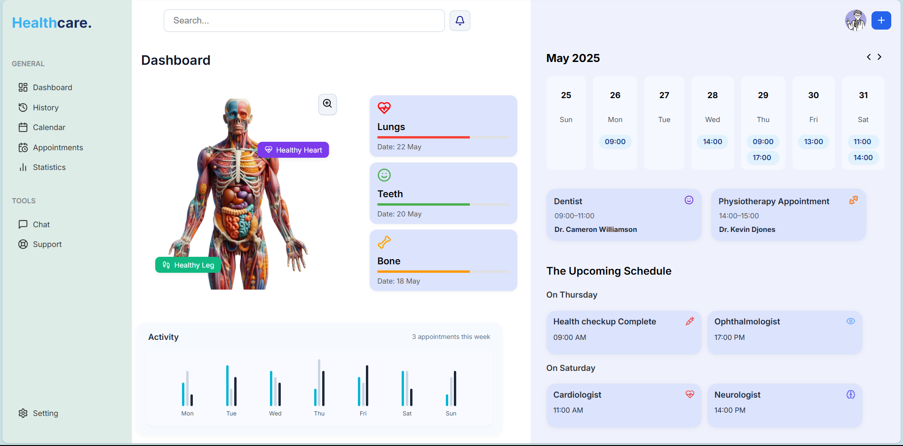

# 🏥 Healthcare Dashboard (FitPeo Frontend Assignment)

This project is a **pixel-perfect static implementation** of a professional Healthcare Dashboard UI, built using **React** and **CSS Modules**. It closely follows the provided design reference to demonstrate precision in layout, spacing, responsiveness, and component structuring.

---

## 🎯 Objective

The goal was to recreate the clean, functional dashboard shown in the reference image with emphasis on:
- **Accurate layout replication**
- **Component reusability**
- **Responsive design across screen sizes**
- **Clean and maintainable code**

---

## 🔧 Tech Stack

- ⚛️ **React** (with Vite)
- 🎨 **CSS Modules** for scoped, maintainable styles
- 📦 **Lucide React Icons**
- 📁 Static mock data through Props(no API/backend)

---

## 📐 Features Implemented

### ✅ Sidebar (Fixed Navigation)
- Icon + label items categorized under *General* and *Tools*
- Responsive adaptation for mobile screens

### ✅ Search Header
- Styled input field with placeholder and notification bell

### ✅ Anatomy Section
- Human anatomy illustration
- Interactive "Healthy Heart" & "Healthy Leg" tags aligned with organ positions
- Adjusts on small screen sizes

### ✅ Health Status Cards
- Shows status for *Lungs*, *Teeth*, *Bones*
- Icon with condition color bar
- Flexibly wrapped layout

### ✅ Weekly Calendar View
- Days rendered with time slots below
- Detailed appointment cards below calendar
- Doctor info with emoji/icon styling

### ✅ Upcoming Schedule
- Displays grouped appointment cards by weekday
- Styled with rounded cards and colored status icons

### ✅ Activity Graph
- bar graph
- Shows mock data per day
- Responsive bar layout

---

## 🧱 Component Structure

src/
├── assets/
├── components/
│   ├── DashboardOverview/
│   ├── LeftOverview/
│   ├── MainDashboard/
│   │   ├── ActivityFeed/
│   │   ├── AnatomySection/
│   │   ├── CalendarSection/
│   │   ├── HealthStatusCards/
│   │   ├── SimpleAppointmentCard/
│   │   ├── UpcomingSchedule/
│   ├── RightOverview/
│   ├── Sidebar/
├── data/
│   ├── activityData.js
│   ├── appointments.js
│   ├── healthStatusData.js
│   ├── navigationLinks.js
├── App.jsx
├── App.module.css
├── index.css
├── main.jsx

Each component:
- Receives props if required
- Encapsulates its own logic + style (via `.module.css`)
- Can be reused or extended easily

---

## 📱 Responsiveness

- **Fully mobile-ready:** tested on iPhone SE (375px) and up
- **Sidebar Fixed on Left & rearranges on small screens**
- **Cards resize or wrap to maintain layout**

---

## 💡 Notable Highlights

- 🎨 Color palette, shadows, and font weights matched 1:1 with provided screenshot
- 🛠️ Minimal external dependencies (fully static)

---

## 📸 Final Output Screenshots

<p align="center">
  
  <br />
  
</p>

---

## 🚀 Setup Instructions

```bash
# Clone the repo
git clone https://github.com/MrDevansh/Healthcare-Dashboard

# Install dependencies
cd HealthCareDashboard
npm install

# Start the development server
npm run dev
